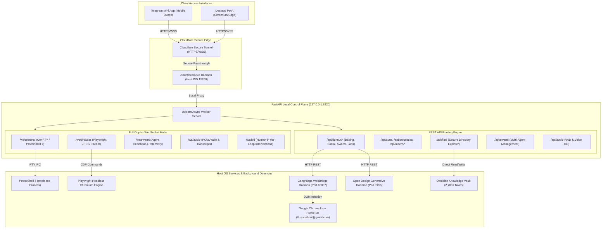
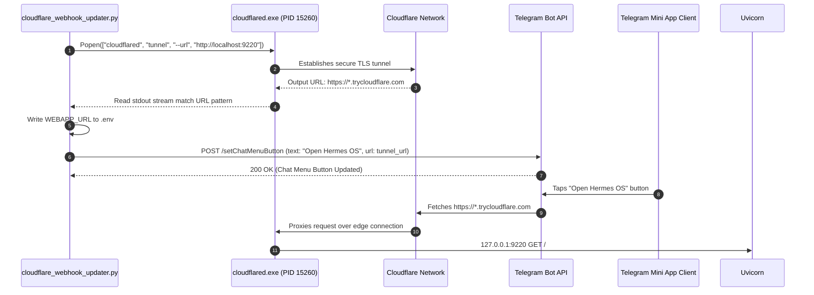

# 🏗️ Hermes OS & Doh-Nut Sovereign Mission Control — System Architecture Specification

> **Technical Architecture Blueprint detailing the system topology, dual-plane IPC communication, full-duplex WebSocket hubs, Cloudflare edge tunneling, GangNiaga WebBridge integration, and zero-trust security model.**

---

## 📜 Audit & Revision Ledger

| Version | Timestamp (MYT / ISO) | Author / Agent | Root Cause / Rationale | Scope & Architectural Changes | Empirical Validation Proof |
|:---|:---|:---|:---|:---|:---|
| **`3.5.0`** | 2026-09-12 15:22:00<br>`2026-09-12T07:22:00Z` | Antigravity Conductor | Penyatuan All-in-1 Mission Control Doh-Nut ke dalam Hermes-WebApp tanpa mengganggu Telegram Menu Button. | `backend/routers/dohnut.py`, `backend/main.py`, `static/index.html`, `docs/ARCHITECTURE.md` | 5/5 API Endpoints 200 OK, Chrome DevTools MCP Desktop & Mobile (390px) verified. |
| **`3.0.0`** | 2026-07-27 18:00:00<br>`2026-07-27T10:00:00Z` | Hermes Dev Squad | Reka bentuk semula Bento-Box Dashboard, pembetulan CSS overlay z-index, integrasi Termux Hacker's Keyboard. | `static/index.html`, `backend/websockets/terminal.py` | 84/84 Pytest suite passed, 14 modul UI lulus ujian headless DOM. |
| **`1.0.0`** | 2026-07-20 12:00:00<br>`2026-07-20T04:00:00Z` | Megat / Bo | Spesifikasi asal seni bina Hermes OS WebApp. | FastAPI + WebSockets + Cloudflare Tunnel | PWA & Telegram WebApp MVP. |

---

## 1. High-Level Architectural Topology

Seni bina sistem berasaskan model **Localized Control Plane** di mana teras pengiraan, pangkalan data, dan eksekusi berada 100% pada persekitaran hos Windows tempatan. Trafik awam disalurkan secara selamat melalui Cloudflare Secure Edge Tunnel terus ke pelayan FastAPI tempatan pada port `9220`.



---

## 2. Core Subsystems & Components

### 2.1 FastAPI Orchestration Engine (`backend/main.py` & `main.py`)
- **Port Availability Fallback**:
  - Pelayan memeriksa ketersediaan port secara dinamik bermula dari `config.PORT` (`9220`), kemudian beralih kepada `9230`, `9225`, `9255`, `9290`, atau `8080` sekiranya berlaku konflik.
- **Lifespan Manager**:
  - Menginisialisasi pembalak berstruktur (`observability.py`), sambungan bot Telegram keluar (`bot_bridge.py`), dan memuatkan pembolehubah persekitaran `.env` sebelum menerima trafik.
- **Pendaftaran Router Modular**:
  - `dohnut_router` (`/api/dohnut`): Mengendalikan operasi perniagaan Doh-Nut, akaun media sosial, integrasi WebBridge, dan status skuad ejen.
  - `system_router` (`/api/stats`, `/api/macro`, `/api/files`, `/api/forensics`).
  - `swarm_router` (`/api/swarm`).
  - `audio_router` (`/api/audio`).

### 2.2 Doh-Nut Sovereign Mission Control Subsystem (`backend/routers/dohnut.py`)
- **Struktur Aliran Data (Data Pipeline)**:
  1. *Telemetry Ingestion*: Mengambil data pesanan dan hasil daripada sistem fail atau pangkalan data jualan tempatan.
  2. *Omnichannel Campaign Synthesis*: Menjana variasi draf teks berstruktur khusus untuk 6 platform media sosial dalam satu panggilan API.
  3. *WebBridge Action Dispatcher*:
     ```python
     # Alur Penyiaran WebBridge ke Profile 50
     async with httpx.AsyncClient(timeout=5.0) as client:
         resp = await client.post(
             "http://127.0.0.1:10087/action/inject",
             json={"platform": req.platform, "content": req.content, "profile": 50},
             headers={"X-API-Key": WEBBRIDGE_API_KEY}
         )
     ```
  4. *Swarm Telemetry Aggregator*: Mengesan ketersediaan nod-nod pintar tempatan (Hermes, Antigravity, WebBridge, Open Design).

### 2.3 Terminal ConPTY Subsystem (`backend/websockets/terminal.py`)
- Membuka subprocess `pwsh.exe -NoProfile -NoLogo` menggunakan modul `ptyprocess` atau Windows Pseudo-Console API (ConPTY).
- Menghapuskan pembaziran lebar jalur dengan memampatkan aksara ANSI warna terus ke klien xterm.js.
- **Penapis PTY Ping**: Mengasingkan bait arahan `0x09` (Tab) dan rentetan JSON `ping`/`pong` supaya kanvas visual terminal kekal bersih daripada cetakan teks sampah.

### 2.4 Hermes Vision Subsystem (`backend/websockets/browser.py`)
- Melancarkan instance pelayar Chromium Playwright berprestasi tinggi.
- Menangkap tangkapan skrin tetingkap aktif pada frekuensi dinamik (adaptive framerate) dan menstrimkannya dalam format Base64 JPEG.
- Mengubah koordinat sentuhan mudah alih Telegram ke koordinat tepat piksel pelayar hos:
  ```
  Normalized Mobile (X, Y) ──► Viewport Ratio Multiplier ──► Playwright mouse.click(px_X, px_Y)
  ```

---

## 3. Network & Edge Tunneling Strategy

### 3.1 Mengapa Cloudflare Tunnels (Bukan Localtunnel / Ngrok)?
- **Localtunnel Limitation**: Localtunnel memaparkan halaman amaran pelindung (*interstitial warning*) yang memerlukan pengguna menekan butang sebelum laman dimuatkan. Telegram Mini App WebView tidak menyokong halaman ini, menyebabkan skrin tergantung (*infinite loading freeze*).
- **Cloudflare Edge Direct Passthrough**: `cloudflared` memberikan penamatan SSL automatik di peringkat edge Cloudflare tanpa sebarang halaman amaran, membolehkan Telegram WebApp dimuatkan serta-merta dalam <1.5 saat.

### 3.2 Dynamic Webhook & Telegram Menu Sync Engine


---

## 4. Frontend State Machine & Viewport Architecture

### 4.1 SPA Architecture & CSS Transitions
- **Bento-Box Grid Hierarchy**:
  - Bahagian Atas: Bar status nod hos & Bar input arahan langsung Hermes.
  - Bahagian Tengah: Grid tindakan pantas 6-butang + Kad Bento Doh-Nut HQ + Kad Multi-Agent Swarm.
  - Bahagian Bawah: Bilah Dok Bawah mengandungi 16 ikon subsistem.
- **Tindanan Skrin Penuh (Full-Screen Slide-Up Overlays)**:
  - Setiap modul menggunakan kelas `.module-overlay`.
  - Apabila diaktifkan (`.module-overlay.active`), modal dinaikkan menggunakan transisi `transform: translateY(0)` dengan fungsi pemasaan `cubic-bezier(0.16, 1, 0.3, 1)`.
  - Menyokong penderiaan sejarah pelayar (`history.pushState` dan `window.onpopstate`) bagi memastikan gerak isyarat leret kembali (*swipe-back*) atau butang kembali peranti bimbit menutup modal tanpa menutup Telegram Mini App.

---

## 5. Security & Isolation Model

```
┌────────────────────────────────────────────────────────────────────────┐
│                        SPLIT-TOKEN SECURITY PLANE                      │
│                                                                        │
│   [HERMES GATEWAY]                           [HERMES WEBAPP]           │
│   • Inbound Long-Polling                     • Outbound API Calls Only │
│   • Receives /commands                       • Sends HITL Alerts       │
│   • Token: GATEWAY_TOKEN                     • Updates Menu Button     │
│                                              • Token: WEBAPP_BOT_TOKEN │
│   ───────────────────────────────────────────────────────────────────  │
│          Zero HTTP 409 Conflict Across Independent Event Loops         │
└────────────────────────────────────────────────────────────────────────┘
```

1. **Sandboxing Directory Traversal**: Laluan sistem fail diakses secara mutlak dengan semakan sekatan laluan induk untuk menghalang eksploitasi direktori `../..`.
2. **Kunci Fail Pelayar Defensif**: Membaca atau memanipulasi profil Google Chrome dilakukan sepenuhnya menerusi protokol REST / CDP GangNiaga WebBridge, mengelakkan ralat perkongsian pangkalan data SQLite (`database is locked`).
3. **Penyelia Proses Latar Belakang (Zombie Task Hygiene)**: Setiap arahan shell yang dijalankan oleh ejen didaftarkan ke dalam pemantau tugas latar belakang (`manage_task`) dan ditamatkan serta-merta selepas bacaan log selesai.
